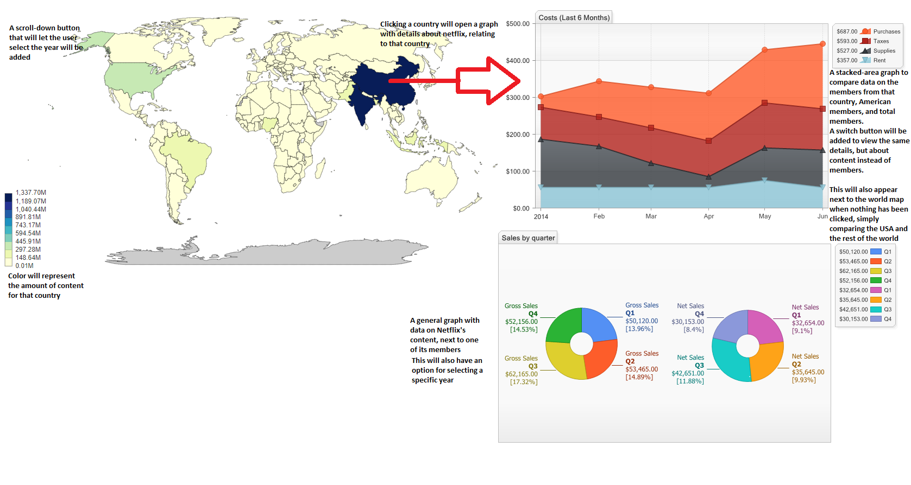

# Minor Programming Project Sebastiaan Schneider
# Visualization of Netflix's Diversity

For my project, I will create a visual comparison of data on Netflix's original content. In recent years, Netflix has grown immensely, both in members and in its content. Though it was initially only available in the USA, nowadays, it's globally available.
With this globalization of the platform, the company behind it seems to be diversifying its content, little by little. By the year 2018, over half of the members were from countries other than the USA, and growing.
The central question I will be exploring is: considering its growing international audience, is Netflix diversifying its original content to match this change, or does it remain a primarily American-focused platform?
The target audience for this would be (prospective) investors in Netflix, as well people interested in the platform's diversity in general.

To answer this, I will provide multiple points of view to compare data on:
  - Netflix's original content (series and movies)
  - Netflix's memberships (numbers and makeup)

Netflix's original content is defined as the following: series and movies created exclusively for Netflix and is available all over the world, since Netflix hold the license. This does not include tv shows that were "extended" by Netflix, since the license may be split between multiple parties. This does include shows made by Netflix in partnership with other companies, but that are released exclusively on its platform.
This data will be gathered by scraping Netflix's website (https://www.netflix.com/nl-en/originals) for a series or movie's release date, original language, and amount. The original language will be taken as a series or movies being intended for countries that primarily use that language. This does create a complication by including countries other than the USA that have English as (one of) their first language(s), for which I'm still trying to come up with a solution. For the amount, I'm currently planning on counting a season of a series or a single movie as one token, though this may be changed to reflect the length of content instead.

For Netflix's memberships, the definition is very straight-forward: any membership counts as one token. This relates the income, and thus possible incentive for local content, they provide, rather than speculating how many people might be sharing an account on average.
The data will come directly from Netflix's own quarterly results (and, as of now, can only be entered by hand) for every year since their digital launch in 1999. These numbers will be gathered from their own investor website (https://www.netflixinvestor.com/ir-overview/profile/default.aspx). For every year, the company's total members, what portion of that is from the USA, and what portion is from outside the USA will be noted. Currently, I have not found a way to further specify the locations of members outside the USA, but that would make the data even more interesting, since it could then be compared to the languages of content.

This visualization will allow users to compare Netflix's data for a specific year on a global scale, and then look closer at country-specific data:

The main features available to users will be:
  - Selecting a specific year
  - Selecting a specific country or language
  - Selecting a variable that will be compared, either content or memberships

The minimum viable product would include the world map, including color representation relating to the selected variable, and the ability to view data for a specific country or language.
Optionally, I'd like to add the ability to see Netflix's income from the different regions, and thus what they "should" be spending on shows for that region, and add a projection of what the platform may look like in the next couple of years. If time allows, I'd also like to add an animation to the visualization. Lastly, I could compare the types of content (series vs movies, genre).

My data sources are both from Netflix itself:
https://www.netflix.com/nl-en/originals
https://www.netflixinvestor.com/ir-overview/profile/default.aspx

The external components I'm currently planning on using are:
  - D3
  - d3.geomap or amMaps
  - The JS Library

Some existing visualization examples I'll be basing parts of my own on:
- An article by Forbes, which discusses the state of Netflix from several angles, some of which are unrelated to my current plans. They do, however make clever use of bar charts to compare the amount of memberships for continent, which I might still take into consideration. https://www.forbes.com/sites/louiscolumbus/2018/07/12/10-charts-that-will-change-your-perspective-of-netflixs-massive-success-in-the-cloud/#63ad70932303
- Recode.net and Business Insider, which have fairly plain representations of USA memberships against international ones. These are effective and achieve what they mean to, but are much simpler than what I'd like to do. https://www.recode.net/2018/4/16/17243676/nflx-netflix-reed-hastings-q1-earnings-stock-subscribers https://www.businessinsider.nl/netflix-subscribers-chart-2017-1/?international=true&r=US
- Comparitech.com, which has a number of interesting insights and ways of achieving them. In terms of graphs, they too are not very innovative, but it's interesting to use as a reference nonetheless. https://www.comparitech.com/blog/vpn-privacy/netflix-statistics-facts-figures/

All of these articles do rely heavily on text to bring their point across, while I aim to use as little text as possible.

The hardest parts will be in gathering and processing the data and gathering it all into one world map. Since the data will be scraped from Netflix's own website, which is quite well-fromatted, there aren't that many variations that need to be accounted for in the process. Getting this data to relate to countries around the world, however, could prove difficult and might require a number of restrictions for it to work well. I may need to group together all Spanish-speaking countries as one target audience, for instance. When making the interactive world map, I'll need to make sure to clearly separate, yet link, the variables, to make sure they never get tangled up when switching to another view.
